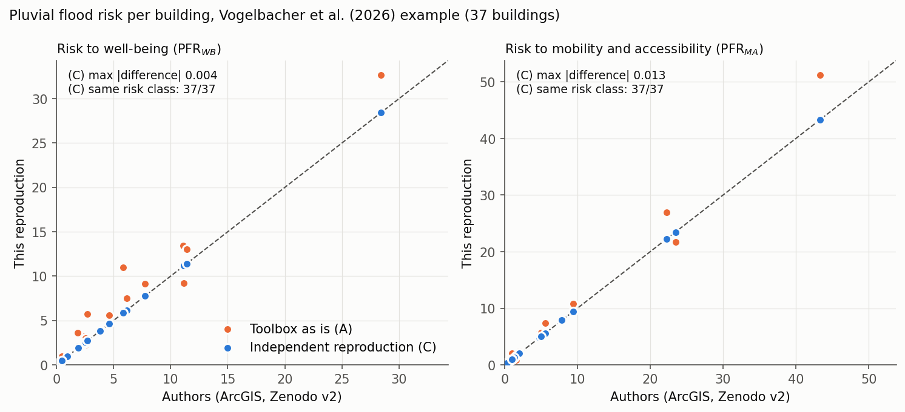
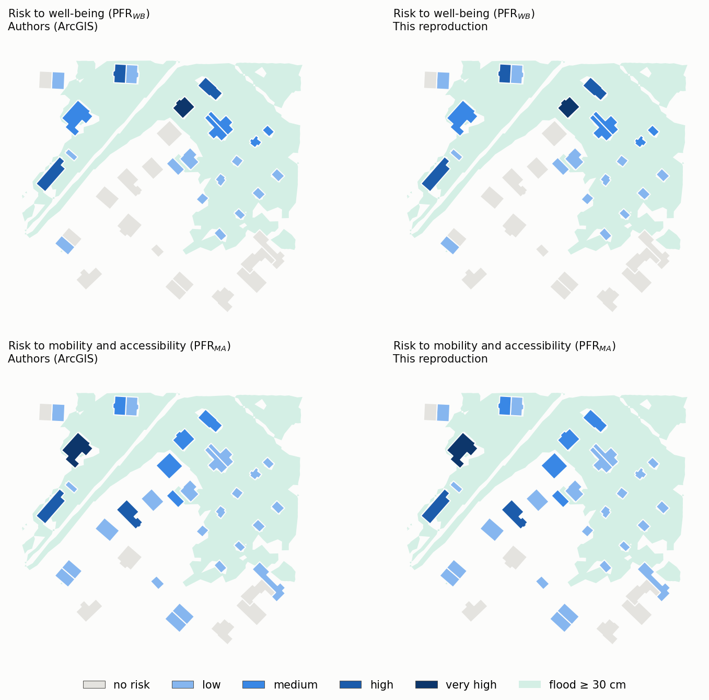

# Independent reproduction of building-level urban pluvial flood risk

> **Reproduced paper:** Vogelbacher, A., von Szombathely, M., Lennartz, M., Poschlod, B. and Sillmann, J. (2026).
> *A high-resolution framework for urban pluvial flood risk mapping.* Natural Hazards and Earth System Sciences 26, 2765–2783.
> [doi:10.5194/nhess-26-2765-2026](https://doi.org/10.5194/nhess-26-2765-2026)

The paper computes building-level pluvial flood risk (social vulnerability × exposure × hazard) in ArcGIS Pro and demonstrates it on a synthetic example for a Hamburg city quarter (37 buildings), published with its data and output on Zenodo ([10.5281/zenodo.19860733](https://doi.org/10.5281/zenodo.19860733)). This FORRT reproduction redoes the calculation with an independent open Python implementation and compares it building by building with the authors' output.



**Result.** Social vulnerability is reproduced exactly; the hazard and risk indices agree to the fourth decimal; every building falls in the same risk class as in the paper, for both risk to well-being and risk to mobility and accessibility (37/37). **Verdict: Validated** on the authors' example. Three details had to be inferred from the authors' results and scripts because the paper's text differs: the sensitivity weights, the TOPSIS normalisation, and hazard rings that exclude neighbouring buildings.



The notebooks that follow run the whole pipeline: [download](notebooks/01_data_download.ipynb) both versions of the authors' deposit, [unpack](notebooks/02_data_clean.ipynb) the ArcGIS layer package, [analyse](notebooks/03_analysis.ipynb) and draw the [figures](notebooks/04_figures.ipynb).

## Run it

```bash
git clone https://github.com/annefou/hamburg-pluvial-flood-replication.git
cd hamburg-pluvial-flood-replication
pixi install
pixi run snakemake --cores 1
```

## Credits

Paper, method, data and ArcGIS toolbox: Anastasia Vogelbacher, Malte von Szombathely, Marc Lennartz, Benjamin Poschlod, Jana Sillmann. FAIR2Adapt `urban_pfr` toolbox (comparison): Esteban González, Zakieh Alizadehsani, José A. Zaino, Sonja Spälter, Anne Fouilloux. This reproduction: Anne Fouilloux (LifeWatch ERIC).

## Nanopublication chain

The published chain is listed in [`nanopubs/PUBLISHED.md`](nanopubs/PUBLISHED.md). Each step links to its viewer URL on the Science Live platform.

## Citation

If you use this work, please cite both:

- This software: [`CITATION.cff`](CITATION.cff) → DOI [{{ZENODO_DOI}}]({{ZENODO_DOI}}).
- The original paper: [10.5194/nhess-26-2765-2026](https://doi.org/10.5194/nhess-26-2765-2026).
